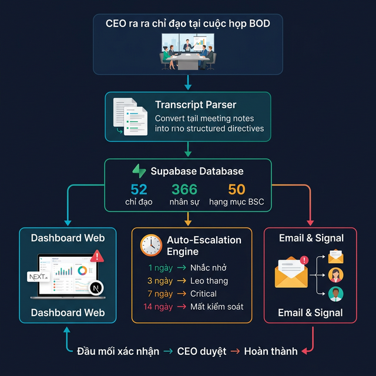
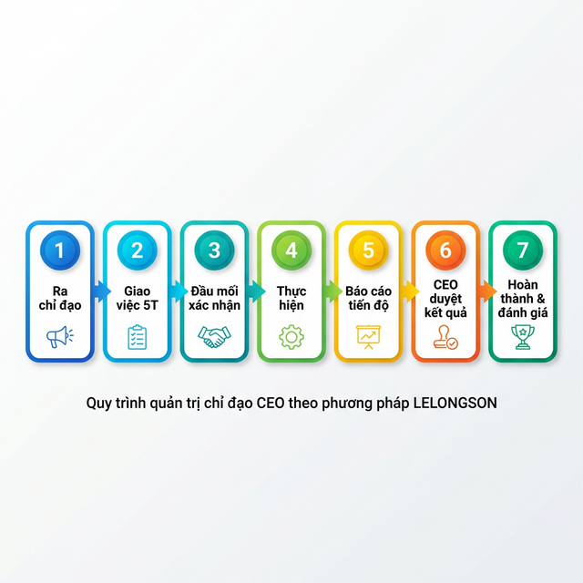
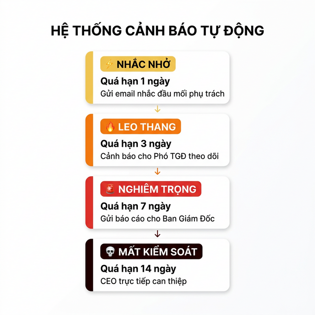

# 📋 CEO Directives — Hệ Thống Quản Trị Chỉ Đạo CEO

> **EsuhaiGroup S2** — Theo dõi chỉ đạo CEO từ cuộc họp BOD đến hoàn thành, tự động nhắc nhở & leo thang

---

## Giới Thiệu Nhanh

Hệ thống này giúp **CEO và Ban Giám Đốc** quản lý chỉ đạo một cách tự động:

1. **CEO ra chỉ đạo** tại cuộc họp BOD
2. Hệ thống **tự động giao việc** cho đầu mối phụ trách
3. Đầu mối **xác nhận 5T** (ai làm, làm gì, đo gì, khi nào, ngân sách)
4. Hệ thống **tự động nhắc nhở** nếu quá hạn
5. **Leo thang tự động** lên Ban Giám Đốc nếu không xử lý
6. CEO **duyệt kết quả** và đóng chỉ đạo



---

## Quy Trình 7 Bước (LELONGSON)

Mỗi chỉ đạo đi qua 7 bước từ lúc CEO phát biểu đến lúc hoàn thành:



| Bước | Tên | Người thực hiện |
|------|-----|-----------------|
| 1 | Ra chỉ đạo | CEO tại cuộc họp BOD |
| 2 | Giao việc 5T | Hệ thống tự động phân bổ |
| 3 | Đầu mối xác nhận | Người được giao nhấn "Xác nhận" |
| 4 | Thực hiện | Đầu mối triển khai công việc |
| 5 | Báo cáo tiến độ | Đầu mối cập nhật kết quả |
| 6 | CEO duyệt | BOD Hosting duyệt/yêu cầu bổ sung |
| 7 | Hoàn thành | Đóng chỉ đạo, đánh giá hiệu quả |

### Quy Tắc 5T — Mỗi chỉ đạo phải rõ ràng 5 yếu tố

| T | Yếu tố | Câu hỏi |
|---|--------|---------|
| **T1** | Đầu mối | **Ai** chịu trách nhiệm? |
| **T2** | Nhiệm vụ | **Làm gì** cụ thể? |
| **T3** | Tiêu chí | **Đo lường** kết quả bằng gì? |
| **T4** | Thời hạn | **Khi nào** phải xong? |
| **T5** | Tài chính | **Ngân sách** bao nhiêu? |

---

## Hệ Thống Cảnh Báo Tự Động

Mỗi sáng 8h, hệ thống tự kiểm tra tất cả chỉ đạo và gửi cảnh báo theo 4 cấp:



| Cấp | Quá hạn | Hệ thống tự động làm gì |
|-----|---------|--------------------------|
| ⚡ Nhắc nhở | 1 ngày | Gửi email nhắc đầu mối phụ trách |
| 🔥 Leo thang | 3 ngày | Cảnh báo Phó TGĐ theo dõi |
| 🚨 Nghiêm trọng | 7 ngày | Gửi báo cáo cho Ban Giám Đốc |
| 💀 Mất kiểm soát | 14 ngày | CEO trực tiếp can thiệp |

---

## Phân Loại Chỉ Đạo

Hệ thống tự nhận biết 3 dạng chỉ đạo và xử lý khác nhau:

| Dạng | Ví dụ | Cách xử lý |
|------|-------|------------|
| 👤 **Cá nhân** | "Đặng Tiến Dũng triển khai..." | Gửi email trực tiếp cho người đó |
| 👥 **Nhóm** | "Tất cả MS thực hiện..." | Quy về trưởng bộ phận (Đặng Tiến Dũng — MSA) |
| 🏢 **Tổng thể** | "Toàn hệ thống triển khai..." | Gửi BOD Hosting + CC toàn bộ Ban Giám Đốc |

---

## Công Nghệ Sử Dụng

| Thành phần | Công nghệ | Vai trò |
|------------|-----------|---------|
| 🌐 Dashboard | **Next.js 16** | Giao diện web theo dõi chỉ đạo |
| 💾 Cơ sở dữ liệu | **Supabase (PostgreSQL)** | Lưu trữ chỉ đạo, nhân sự, events |
| ⚡ Tự động hóa | **Supabase Edge Functions** | Cron job nhắc nhở & leo thang |
| 📧 Email | **Node.js + SMTP** | Gửi email xác nhận, nhắc nhở |
| 📱 Signal | **Signal REST API** | Báo cáo tuần cho CEO |
| 🔄 Scripts | **Node.js** | Seed data, dedup, reporting |

### Dữ Liệu Hiện Tại (17/03/2026)

| Dữ liệu | Số lượng |
|----------|----------|
| Chỉ đạo CEO | **52** (từ 3 cuộc BOD) |
| Nhân sự Esuhai | **366** người |
| Hạng mục BSC | **50** hạng mục chiến lược |
| Email đã mapping | **52/52 (100%)** |
| Cron job tự động | **1** (8h sáng hàng ngày) |

---

## Cách Sử Dụng

### 1. Xem Dashboard (Trang theo dõi)

```bash
# Cài đặt lần đầu
cd web
npm install

# Chạy dashboard
npm run dev
```

Mở trình duyệt: **http://localhost:3000**

Dashboard hiển thị:
- 📊 Tổng quan trạng thái chỉ đạo
- ⚡ Alert Panel — cảnh báo quá hạn 3 cấp
- 🗓️ Timeline — lịch sử sự kiện
- 🌡️ Heatmap 50 Hạng Mục BSC
- 📈 LELONGSON Pipeline — tiến độ 7 bước

### 2. Các Trang Quan Trọng

| Trang | URL | Ai dùng | Để làm gì |
|-------|-----|---------|-----------|
| Dashboard chính | `/` | CEO, Ban Cố Vấn | Xem tổng quan tất cả chỉ đạo |
| Trợ lý CEO | `/dashboard/assistant` | Trợ lý CEO | Xem chi tiết + hành động |
| Chi tiết chỉ đạo | `/directive/[id]` | Tất cả | Xem chi tiết 1 chỉ đạo |
| Xác nhận 5T | `/confirm/[id]` | Đầu mối | Xác nhận đã nhận chỉ đạo |
| Duyệt kết quả | `/approve/[id]` | BOD Hosting | Duyệt/từ chối kết quả |

### 3. Chạy Scripts Tự Động

```bash
cd automation

# Seed email — gắn email cho chỉ đạo (chạy 1 lần)
node seed-emails.js

# Kiểm tra trùng lặp — tìm chỉ đạo bị lặp giữa các cuộc họp
node dedup-directives.js

# Báo cáo tuần — gửi qua Signal
node signal-briefing.js --dry-run    # Xem trước (không gửi)
node signal-briefing.js              # Gửi thật
```

### 4. API cho Tích Hợp Bên Ngoài

| API | Phương thức | Chức năng |
|-----|-------------|-----------|
| `/api/status` | GET | Trạng thái hệ thống (health score, alerts) |
| `/api/confirm` | POST | Đầu mối xác nhận 5T |
| `/api/approve` | POST | BOD duyệt/từ chối |
| `/api/escalate` | POST | Leo thang lên CEO |
| `/api/remind` | POST | Gửi nhắc nhở thủ công |

---

## Cấu Trúc Thư Mục

```
CEO-Directives/
│
├── 📂 web/                         ← Dashboard (Next.js)
│   ├── src/app/
│   │   ├── page.tsx                ← Trang chính
│   │   ├── components/             ← Các component UI
│   │   │   ├── alert-panel.tsx     ← Bảng cảnh báo 3 cấp
│   │   │   ├── deadline-countdown  ← Đếm ngược deadline
│   │   │   ├── engagement-activity ← Timeline sự kiện
│   │   │   ├── bsc-scorecard.tsx   ← Bảng điểm BSC
│   │   │   ├── lelongson-pipeline  ← Pipeline 7 bước
│   │   │   └── hm50-heatmap.tsx    ← Heatmap 50 hạng mục
│   │   ├── api/                    ← API endpoints
│   │   ├── dashboard/assistant/    ← Trang Trợ lý CEO
│   │   ├── confirm/[id]/           ← Trang xác nhận 5T
│   │   ├── approve/[id]/           ← Trang duyệt kết quả
│   │   └── directive/[id]/         ← Chi tiết chỉ đạo
│   └── src/lib/supabase.ts         ← Kết nối database
│
├── 📂 automation/                   ← Scripts tự động (Node.js)
│   ├── seed-emails.js              ← Gắn email cho chỉ đạo
│   ├── dedup-directives.js         ← Tìm chỉ đạo trùng lặp
│   ├── signal-briefing.js          ← Báo cáo tuần qua Signal
│   ├── wf1-approval.js             ← Email phê duyệt 2 bước
│   ├── wf4-directive-escalation.js ← Leo thang quá hạn
│   ├── wf5-reminders.js            ← Nhắc nhở thông minh
│   └── lib/email-templates.js      ← Mẫu email
│
├── 📂 supabase/                     ← Hạ tầng database
│   └── functions/
│       └── auto-escalation/        ← Cron job leo thang tự động
│           └── index.ts            ← Edge Function (chạy 8h sáng)
│
├── 📂 ban_chep_loi/                 ← Biên bản cuộc họp BOD
│   ├── BOD_02032026.md
│   ├── BOD_09032026.md
│   └── BOD_16032026.md
│
├── 📂 docs/                         ← Tài liệu
│   ├── images/                     ← Hình minh họa
│   └── tasks/                      ← Task cho team
│
├── 📂 archive/                      ← Code cũ (lưu trữ)
│
├── README.md                        ← 📖 File này
├── SYSTEM_AUDIT.md                  ← Trạng thái hệ thống
├── CLAUDE.md                        ← Context cho AI agents
├── changelog.md                     ← Nhật ký thay đổi
└── CONTENT_BIBLE_AIGENT.md          ← Chuẩn giao tiếp AI
```

---

## Cấu Hình

### File `.env` cần thiết

```bash
# === automation/.env ===
SUPABASE_URL=https://xxx.supabase.co
SUPABASE_SERVICE_ROLE_KEY=eyJ...
SUPABASE_ANON_KEY=eyJ...

# Email
SMTP_HOST=smtp.gmail.com
SMTP_PORT=587
SMTP_USER=your-email@gmail.com
SMTP_PASS=app-password

# Signal (optional)
SIGNAL_API_URL=http://localhost:8080
SIGNAL_BOT_NUMBER=+84xxx
SIGNAL_ADMIN_NUMBERS=+84xxx,+84yyy
```

```bash
# === web/.env.local ===
SUPABASE_URL=https://xxx.supabase.co
SUPABASE_SERVICE_ROLE_KEY=eyJ...
NEXT_PUBLIC_SUPABASE_ANON_KEY=eyJ...
```

---

## Team Phát Triển

| Vai trò | Tên | Phụ trách |
|---------|-----|-----------|
| 🎯 CEO / Chủ dự án | Thầy Lê Long Sơn | Ra quyết định, định hướng |
| 🎯 PM / Director | Anh Kha | Quản lý, duyệt, điều phối |
| 🎨 UI / QC | Gravity (Antigravity AI) | Giao diện, tài liệu, kiểm tra |
| ⚙️ Backend / Infra | ClaudeCode (Claude AI) | Database, API, automation |

---

## Lịch Sử Phát Triển

| Phiên bản | Ngày | Thay đổi chính |
|-----------|------|----------------|
| v1.0 | 27/12/2025 | Khởi tạo — Notion + n8n |
| v2.0 | 10/03/2026 | Chuyển sang Node.js automation |
| v2.5 | 14/03/2026 | Telegram Bot + AI Analyzer |
| v3.0 | 15/03/2026 | **Chuyển sang Supabase**, Dashboard Next.js mới |
| v3.5 | 16/03/2026 | BSC Scorecard, LELONGSON Pipeline, HM50 Heatmap |
| **v4.0** | **17/03/2026** | **Auto-Escalation Cron, 52/52 email mapped, phân loại 3 tầng** |

---

## Câu Hỏi Thường Gặp

### Hệ thống chạy tự động không cần ai làm gì hết sao?

Gần như vậy! Sau khi thiết lập, hệ thống tự:
- ✅ Gửi email nhắc nhở khi quá hạn
- ✅ Leo thang lên Ban Giám Đốc nếu không xử lý
- ✅ Ghi lại mọi sự kiện (ai mở email, ai xác nhận, ai duyệt)

Chỉ cần làm thủ công: **nhập biên bản cuộc họp BOD mới** → hệ thống tự phân tách chỉ đạo.

### Nếu thêm cuộc họp BOD mới thì sao?

1. Thêm biên bản vào `ban_chep_loi/`
2. Chạy script parse → chỉ đạo mới được thêm vào database
3. Chạy `node seed-emails.js` → tự gắn email cho đầu mối
4. Cron job sáng mai sẽ bắt đầu theo dõi

### Dashboard truy cập ở đâu?

- **Local**: `npm run dev` → http://localhost:3000
- **Production**: Deploy lên Vercel (đã cấu hình `vercel.json`)

### Muốn xem API status nhanh?

```bash
curl https://your-domain.com/api/status | jq
```

Trả về: health score, số quá hạn, alerts, top 5 hạng mục nóng nhất.

---

> 💡 **Có thắc mắc?** Liên hệ team qua Signal hoặc xem `docs/` để biết thêm chi tiết.
